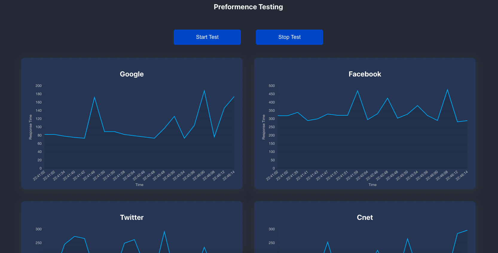

# Preformance Testing App

⚠️ This repository is the Back-End for [performance-testing-client](https://github.com/PoratRoy/performance-testing-client) Front-End

## Technical Stacks
- Worked with [express](https://www.npmjs.com/package/express)
- [axios](https://www.npmjs.com/package/axios)

## Available Scripts

In the project directory, you can run:

### `npm run start`
To run the server on port 4000

or 
### `npm run server`
to run the server on port 4000 with [nodemon](https://www.npmjs.com/package/nodemon)